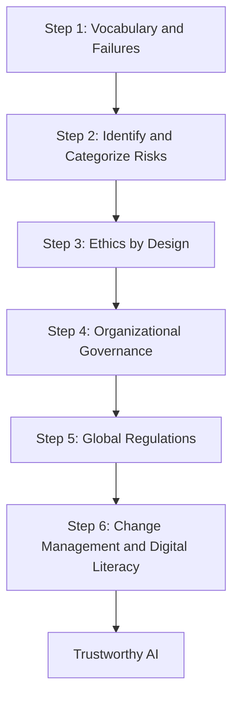
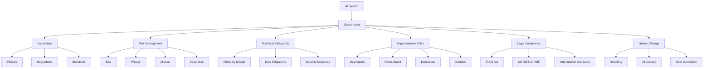
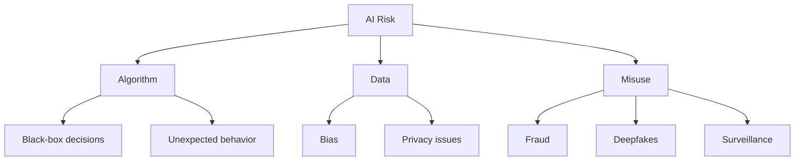
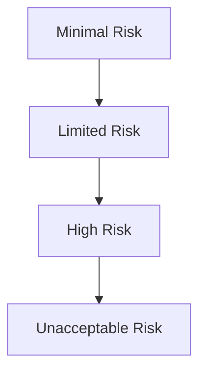

# Foundations of AI Governance

**A practical, easy-to-understand guide to responsible AI.**

This repository provides a structured learning path for understanding **AI Governance**, from basic vocabulary and real-world failure cases to technical safeguards, organizational roles, global regulations, and digital literacy.

It is designed for:

- Students
- Developers
- Product managers
- Compliance and legal teams
- Leaders
- Anyone learning AI responsibility

---

## Why AI Governance Matters

AI can create major benefits, but it can also cause serious harm when used without proper controls.

AI Governance helps organizations and individuals ensure that AI systems are:

- Safe
- Fair
- Transparent
- Accountable
- Privacy-preserving
- Legally compliant
- Trusted by users

This Wiki explains AI Governance in simple language, with diagrams, tables, case studies, and quick references.

---

## Learning Path

This project follows a **Six-Step Mastery Path**.

---

## What You Will Learn

By the end of this Wiki, you will understand:

1. **What AI Governance is**
   - Policies
   - Regulations
   - Standards
   - Ethics

2. **What happens when AI fails**
   - Biased grading
   - False plagiarism detection
   - Privacy harms
   - Discrimination

3. **How AI risks are categorized**
   - Minimal risk
   - Limited risk
   - High risk
   - Unacceptable risk

4. **How to build ethical AI systems**
   - Ethics by Design
   - Bias mitigation
   - Privacy protection

5. **How organizations govern AI**
   - Ethics Boards
   - Peer review
   - Audits
   - Executive accountability

6. **How the world regulates AI**
   - EU AI Act
   - US frameworks
   - China rules
   - UK approach
   - International standards

7. **How people and organizations adapt to AI**
   - Reskilling
   - Change management
   - AI literacy
   - Digital skepticism

---

## Start Here

Begin with the main Wiki page:

👉 **[Wiki Home](wiki/Home)**

---

## Wiki Pages

| Section | Description | Link |
|---|---|---|
| Home | Main landing page | [Home](wiki/Home) |
| Step 1 | Vocabulary and real-world AI failures | [Step 1](wiki/Step-1-Vocabulary-and-Failures) |
| Step 2 | Identifying and categorizing AI risks | [Step 2](wiki/Step-2-Identifying-and-Categorizing-Risks) |
| Step 3 | Ethics by Design and technical safeguards | [Step 3](wiki/Step-3-Ethics-by-Design) |
| Step 4 | Organizational governance and roles | [Step 4](wiki/Step-4-Organizational-Governance) |
| Step 5 | Global regulations and standards | [Step 5](wiki/Step-5-Global-Regulations) |
| Step 6 | Change management and digital literacy | [Step 6](wiki/Step-6-Change-Management) |
| Glossary | Key terms explained simply | [Glossary](wiki/Glossary) |
| Case Studies | Real-world AI failure examples | [Case Studies](wiki/Case-Studies) |
| Quick Reference | One-page cheat sheet | [Quick Reference](wiki/Quick-Reference) |
| One-Page Summary | Compact summary of the full path | [One-Page Summary](wiki/One-Page-Summary) |

<!--
If relative Wiki links do not render in your context, replace them with absolute links:
https://github.com/YOUR-USERNAME/YOUR-REPO/wiki/Page-Name
-->

---

## High-Level Concept Map

---

## Key AI Governance Concepts

| Concept | Simple Meaning |
|---|---|
| AI Governance | The system of rules, roles, and processes used to manage AI responsibly |
| Policy | A non-binding organizational guideline |
| Regulation | A binding legal rule |
| Risk | The possibility that AI causes harm |
| Bias | Unfair treatment of people or groups by an AI system |
| Deepfake | Realistic fake audio, image, or video created using AI |
| Ethics by Design | Building ethical safeguards into AI from the beginning |
| Ethics Board | A cross-functional group that reviews AI ethical risks |
| Audit | A formal review to verify compliance and safety |
| AI Literacy | The ability to understand and use AI responsibly |

---

## Main AI Risk Sources

AI risk can come from three main areas:

---

## Risk-Based Approach

Not all AI systems need the same level of control.

A risk-based approach applies stronger safeguards to systems that can cause greater harm.

| Risk Level | Example | Control Level |
|---|---|---|
| Minimal risk | Spam filter | Light oversight |
| Limited risk | Chatbot | Transparency requirements |
| High risk | Credit scoring, medical AI, grading AI | Strong compliance controls |
| Unacceptable risk | Government social scoring | Banned or heavily restricted |

---

## How to Use This Repository

1. **Start with the Wiki Home**
   - Open [Home](wiki/Home)
   - Read the 60-second summary

2. **Follow the six steps**
   - Work through Step 1 to Step 6 in order

3. **Use the Glossary when needed**
   - Check [Glossary](wiki/Glossary) for term definitions

4. **Review case studies**
   - See [Case Studies](wiki/Case-Studies) for real-world examples

5. **Use Quick Reference for revision**
   - Visit [Quick Reference](wiki/Quick-Reference) for a compact summary

---

## Repository Structure

This project is built around a GitHub Wiki.

| Resource | Purpose |
|---|---|
| `README.md` | Project introduction |
| GitHub Wiki | Main learning content |
| `wiki/Home` | Main Wiki landing page |
| `wiki/Step-*` | Step-by-step learning pages |
| `wiki/Glossary` | Simple definitions |
| `wiki/Case-Studies` | Real-world examples |
| `wiki/Quick-Reference` | Fast review page |
| `wiki/One-Page-Summary` | Compact overview |

---

## Diagrams

The Wiki uses **Mermaid diagrams** to make concepts easier to understand.

Examples include:

- Learning path flowcharts
- Risk source diagrams
- EU AI Act risk tiers
- Ethics by Design workflows
- Organizational governance layers
- Global regulation maps
- Change management cycles

Mermaid is rendered directly in GitHub Markdown.

---

## Who Should Read This?

This repository is useful for:

- Developers learning responsible AI practices
- Product teams building AI features
- Compliance teams preparing for AI regulation
- Legal teams reviewing AI requirements
- Leaders responsible for AI strategy
- Students studying AI ethics
- Users who want to understand AI risks and limitations

---

## Key Takeaway

AI Governance is not only about technology.

It combines:

- People
- Process
- Policy
- Technical safeguards
- Legal compliance
- Organizational accountability
- User responsibility

> **The goal is not to stop AI innovation. The goal is to build AI that benefits society without causing harm.**

---

## Contributing

Contributions are welcome.

If you would like to improve this project, you can:

- Clarify explanations
- Improve diagrams
- Add examples
- Improve accessibility
- Translate content
- Add new case studies
- Add practice questions

Please keep new content clear, beginner-friendly, and structured for a GitHub Wiki.

---

## License

This project is provided for educational and informational purposes.
